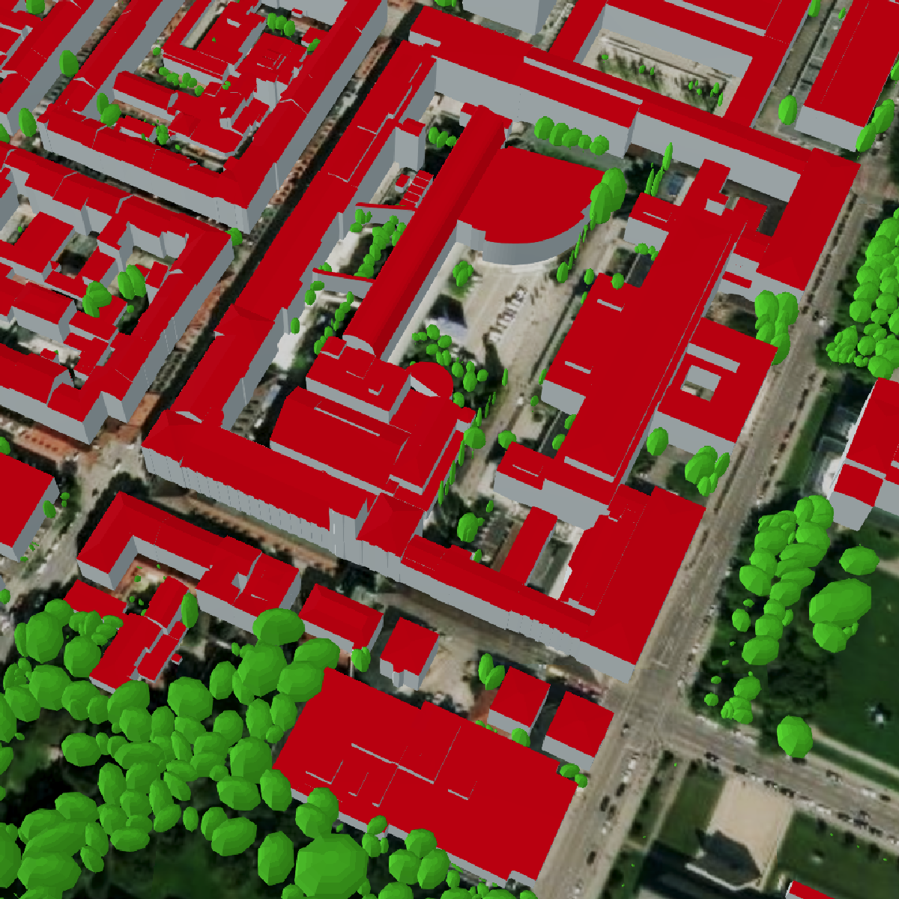

# Creating CityGML datasets

This repo contains tutorials on how to create CityGML datasets.

Please find the full documentation here:

[https://creating-citygml-datasets-test.readthedocs.io/en/latest/](https://creating-citygml-datasets-test.readthedocs.io/en/latest/)

